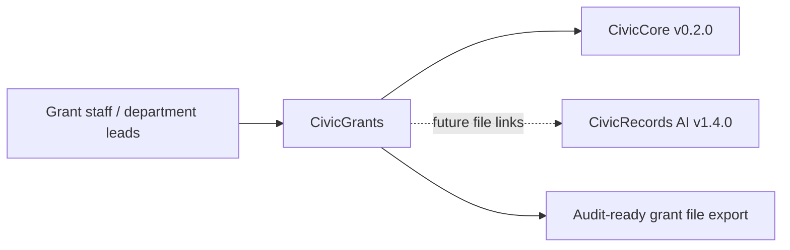

# CivicGrants User Manual

## For Non-Technical Users

CivicGrants helps city staff keep grant opportunities, eligibility notes, application outlines, reporting dates, and audit files organized. It can triage a sample opportunity, show eligibility factors for staff verification, draft an application outline, and build a compliance-calendar scaffold.

Current state: `0.1.0` grant support foundation release. CivicGrants does not provide official eligibility decisions, legal advice, live funder feeds, live LLM calls, submission portals, or grant system-of-record updates. Staff own every decision.

## For IT and Technical Staff

CivicGrants is a FastAPI Python package pinned to `civiccore==0.2.0`. The current runtime exposes:

- `GET /`
- `GET /health`
- `GET /civicgrants`
- `POST /api/v1/civicgrants/opportunities/triage`
- `POST /api/v1/civicgrants/eligibility/match`
- `POST /api/v1/civicgrants/applications/outline`
- `POST /api/v1/civicgrants/compliance/calendar`
- `POST /api/v1/civicgrants/export`

Run:

```bash
python -m pip install -e ".[dev]"
python -m pytest -q
bash scripts/verify-release.sh
```

## Architecture



CivicGrants depends on CivicCore. CivicCore does not depend on CivicGrants. CivicGrants v0.1.0 uses deterministic sample grant data only; live funder feeds, CivicRecords file links, staff review queues, and production grant-system integrations are future work.
