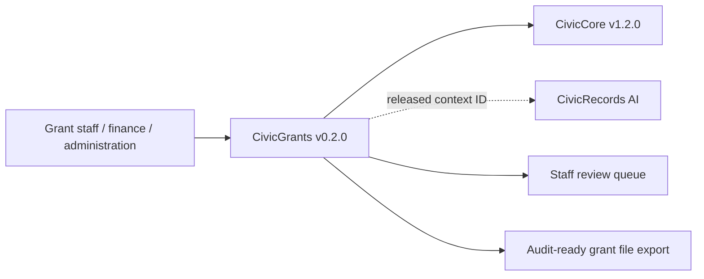

# CivicGrants User Manual

## For Non-Technical Users

CivicGrants helps city staff keep grant opportunities, eligibility notes, application outlines, reporting dates, staff review queues, CivicRecords context references, and audit files organized. It can triage an opportunity, show eligibility factors for staff verification, draft an application outline, build a compliance-calendar scaffold, preserve review-required grant file context, and expose an API-backed public sample UI.

Current state: 0.2.0 grant support and staff review queue runtime. CivicGrants can optionally save grant opportunity, compliance-calendar, and staff review queue records when IT configures `CIVICGRANTS_GRANT_DB_URL`. Staff-only review routes also require `CIVICGRANTS_STAFF_API_KEY`. CivicGrants does not provide official eligibility decisions, legal advice, live funder feeds, live LLM calls, submission portals, award acceptance, or grant system-of-record updates. Staff own every decision.

## For IT and Technical Staff

CivicGrants is a FastAPI Python package pinned to the published `civiccore v1.2.0` release wheel. The current runtime exposes:

- `GET /`
- `GET /health`
- `GET /civicgrants`
- `POST /api/v1/civicgrants/opportunities/triage`
- `POST /api/v1/civicgrants/eligibility/match`
- `POST /api/v1/civicgrants/applications/outline`
- `POST /api/v1/civicgrants/compliance/calendar`
- `GET /api/v1/civicgrants/compliance/{compliance_id}`
- `POST /api/v1/civicgrants/context/grant-review`
- `POST /api/v1/civicgrants/integrations/mock/grant-context`
- `POST /api/v1/civicgrants/staff/reviews`
- `GET /api/v1/civicgrants/staff/reviews`
- `PATCH /api/v1/civicgrants/staff/reviews/{review_id}`
- `GET /api/v1/civicgrants/staff/reviews/summary`
- `POST /api/v1/civicgrants/export`

Set `CIVICGRANTS_GRANT_DB_URL` to enable local SQLAlchemy-backed grant records. Set `CIVICGRANTS_STAFF_API_KEY` before using staff-only queue routes. Staff routes require:

- `X-CivicGrants-Role: staff`
- `X-CivicGrants-Staff-Key: <configured key>`

Run:

```bash
python -m pip install https://github.com/CivicSuite/civiccore/releases/download/v1.2.0/civiccore-1.2.0-py3-none-any.whl
python -m pip install -e ".[dev]"
python -m pytest -q
bash scripts/verify-release.sh
```

## Architecture



CivicGrants depends on CivicCore. CivicCore does not depend on CivicGrants. CivicGrants v0.2.0 uses deterministic sample data plus optional staff-gated persistence, review-required context packets for CivicRecords/grant-file references, staff review queue records, and adversarial local mocks for integration-depth validation.
